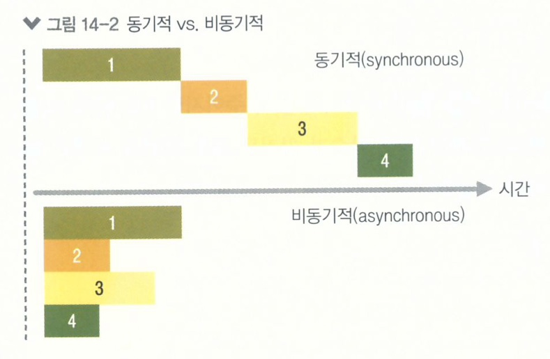

# 외부 API를 연동하여 뉴스 뷰어 만들기
* https://github.com/dkdlel/NewsViewer

## 비동기 작업
* 웹 애플리케이션에서 서버 쪽 데이터가 필요할 때는 Ajax 기법을 사용하여 API를 호출함으로써 데이터를 수신
* 네트워크 송수신 과정에서 시간이 걸리기 때문에 작업이 즉시 처리되는 것이 아니라, 응답을 받을 때 까지 기다린 후 데이터를 처리
|동기적|비동기적|
|:---:|:---:|
|요청이 끝날때 까지 기다리는 동안 중지 상태|웹 애플리케이션이 멈추지 않음|
|다른 작업 불가|동시에 여러 요청을 처리, 다른 함수도 호출 가능|

## 콜백 함수
* 비동기의 가장 흔한 방법으로 콜백 함수(setTimeout)를 사용
    - 여러번 중첩되어 코드의 가독성이 나빠진 코드를 '콜백 지옥'이라고 함
    - 지양해야 할 형태의 코드

## Promise
* 콜백 지옥 같은 코드가 형성되지 않게 하는 방안으로 ES6에 도입된 기능
    - 함수를 여러번 감싸는 것이 아니라 .then을 사용하여 그다음 작업을 설정하기 때문에 콜백 지옥이 형성되지 않음
* resolve : 성공 / reject : 실패
* Promise에서 resolve된 값은 .then을 통해 받아 올 수 있음
* Promise를 return 하면 또 .then으로 처리 가능

## async / await
* Promise를 더욱 쉽게 사용할 수 있도록 해주는 ES2017(ES8) 문법
* 함수 앞부분에 async 키워드를, 해당 함수 내부에서 Promise의 앞부분에 await 키워드를 사용
    - Promise가 끝날 때 까지 기다리고, 결과 값을 특정 변수에 담을 수 있음