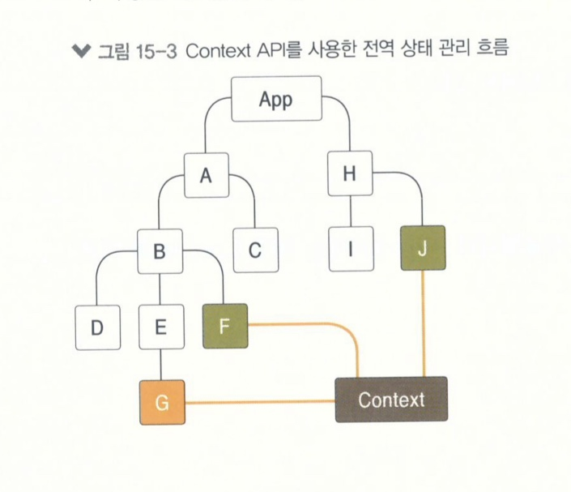

# Context API
* 전역적으로 사용할 데이터가 있을 때 유용한 기능
    - ex) 사용자 로그인 정보, 애플리케이션 환경 설정, 테마 등

## 전역상태 관리 흐름
* React APP은 컴포넌트 간에 데이터를 props로 전달
    - 여기저기서 필요한 데이터의 경우 최상위 컴포넌트인 APP에서 상태를 관리
    - 위 과정에서 다른 컴포넌트에 전달하기 위해서는 여러 컴포넌트를 거쳐야 함
* 이러한 방식을 사용하면 유지 보수성이 낮아질 가능성이 있음
* Context API를 사용하면 Context를 만들어 단 한번에 원하는 값을 받아와서 사용할 수 있음



## 사용법
* 새로운 Context를 만들 때는 createContext 함수를 사용
    - 파라미터에는 해당 Context의 기본 상태를 지정

* Consumer
    * Function as a child, Render Props
        - 컴포넌트의 children이 있어야 할 자리에 일반 JSX 혹은 문자열이 아닌 함수를 전달하는 것

* Provider
    * Context의 value를 변경할 수 있음

## useContext Hook
* 리액트에 내장되어 useContext라는 Hook
```
components/ColorBox.js

import React, { useContext } from 'react';
import ColorContext from '../contexts/color';

const ColorBox = () => {
    const { state } = useContext(ColorContext);
    return(
        <>
            <div 
                style={{
                    width: '64px',
                    height: '64px',
                    background: state.color,
                }}
            />
            <div 
                style={{
                    width: '32px',
                    height: '32px',
                    background: state.subcolor,
                }}
            />
        </>
    );
};

export default ColorBox;
```

## static contextType
* 클래스형 컴포넌트에서 Context를 좀 더 쉽게 사용할 수 있음

|장점|단점|
|:---:|:---:|
|클래스 메서드에서도 Context에 넣어 둔 함수를 호출할 수 있다|한 클래스에서 하나의 Context밖에 사용하지 못함|

* components/SelectColors.js 참고
