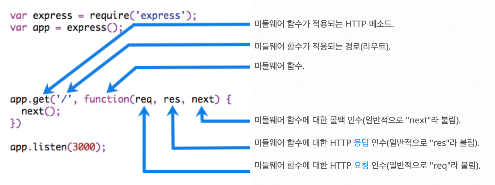

# 백엔드 프로그래밍: Node.js의 Koa 프레임 워크
* Koa 프레임워크 대신 Express.js 사용

## 백엔드 프로그래밍(서버 프로그래밍)
* 어떤 종류의 데이터를 몇 개씩 보여 줄지, 어떻게 보여 줄지 등에 관한 로직을 만드는 것
* 여러 가지 환경으로 진행할 수 있음

## Node.js
* 서버에서도 자바스크립트를 사용할 수 있는 런타임
* Express.js
    - 미들웨어, 라우팅, 템플릿, 파일 호스팅등과 같은 다양한 기능이 자체적으로 내장
* Koa.js
    - 미들웨어 기능만 갖추고 있음
    - 필요한 기능을 붙여서 서버를 만들기 때문에 Express보다 훨씬 가벼움
    - async/await 문법을 정식으로 지원하기 떄문에 비동기 작업을 더 편하게 관리

## Express 미들웨어
```
(req, res, next) => {
}
```
* task
    - Execute any code / 모든 코드를 실행
    - Make changes to the request and the response objects / 요청과 응답 오브젝트에 대한 변경을 실행
    - End the request-response cycle / 요청-응답 주기를 종료
    - Call the next middleware in the stack / 스택의 다음 미들웨어 호출
* next
    - 현재의 미들웨어 함수가 요청-응답 주기를 종료하지 않는 경우에는 next()를 호출하여 그 다음 미들웨어 함수에 제어를 전달
    - 그렇지 않으면 해당 요청은 정지된 채로 방치



* app.use(path, callback)
    - 요청된 경로와 path가 일치할 때 미들웨어 기능이 수행