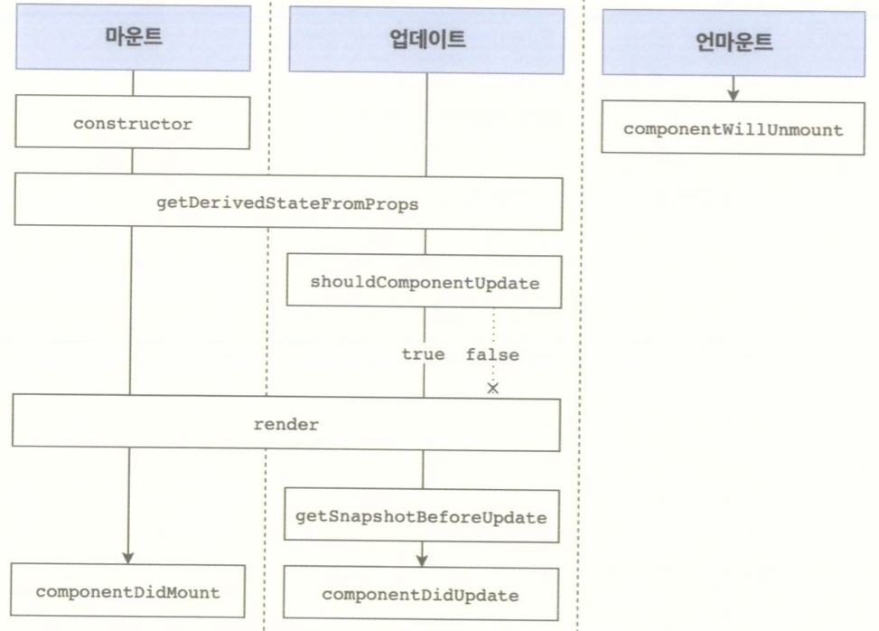

# 컴포넌트의 라이프사이클 메서드
* 컴포넌트의 수명은 페이지에 렌더링되기 전인 준비 과정에서 시작하여 페이지에서 사라질 때 끝남
* 클래스형 컴포넌트에서만 사용 가능
    - Hooks 기능을 사용하여 함수형 컴포넌트에서도 비슷한 작업 가능

## 컴포넌트의 라이프사이클 메서드를 사용하는 경우
1. 컴포넌트를 처음으로 렌더링 할 때 어떤 작업을 처리하는 경우
2. 컴포넌트를 업데이트하기 전후로 어떤 작업을 처리해야 하는 경우
3. 불필요한 업데이트를 방지해야 하는 경우

## 라이프사이클 메서드의 이해
|Will|Did|
|:---:|:---:|
|어떤 작업을 작동하기 전 실행|어떤 작업을 작동한 후 실행|

1. 마운트
    * DOM이 생성되고 웹 브라우저상에 나타나는 것
        - constructor : 컴포넌트를 새로 만들 때마다 호출되는 클래스 생성자 메서드(함수형에는 없음)
        - getDerivedStateFromProps : props에 있는 값을 state에 넣을 때 사용하는 메서드
        - render : 우리가 준비한 UI를 렌더링하는 메서드
        - componentDidMount : 컴포넌트가 웹 브라우저상에 나타난 후 호출하는 메서드

2. 업데이트
    - props가 바뀔 때
    - state가 바뀔 때
    - 부모 컴포넌트가 리렌더링될 때
    - this.forceUpdate로 강제로 렌더링을 트리거할 때

3. 언마운트
    * 마운트의 반대 과정, 즉 컴포넌트를 DOM에서 제거하는 것

|Will, Did|마운트, 업데이트, 언마운트|
|:---:|:---:|
|렌더링 기준|컴포넌트 기준|

## 라이프사이클 메서드 살펴보기
1. render
    * 컴포넌트 모양새를 정의
    * 메서드 안에서 this.props와 this.state에 접근할수 있으며, 리액트 요소를 반환
    * 이벤트 설정이 아닌곳에서 setState를 사용하면 안되며, 브라우저의 DOM에 접근해서도 안됨

2. constructor
    * 컴포넌트 생성자 메서드
    * 컴포넌트를 만들 때 처음으로 실행
    * 초기 state를 정할 수 있음

3. getDerivedStateFromProps
    * props로 받아 온 값을 state에 동기화시키는 용도로 사용
    * 컴포넌트가 마운트될 때, 업데이트될 때 호출

4. componentDidMount
    * 컴포넌트를 만들고, 첫 렌더링을 다 마친 후 실행
    * 다른 자바스크립트 라이브러리, 프레임워크의 함수 호출, 이벤트 등록, setTimeout, setInterval, 네트워크 요청같은 비동기 작업을 처리

5. shouldComponentUpdate
    * props 또는 state를 변경했을 때, 리렌터링을 시작할지 여부를 지정
    * 반드시 true, false를 반환

6. getSnapshotBeforeUpdate
    * render에서 만들어진 결과물이 브라우저에 실제로 반영되기 직전에 호출
    * 업데이트하기 직전의 값을 참고할 일이 있을 때 활용(스크롤바 위치 유지)
    * componentDidUpdate에서 세 번째 파라미터인 snapshot 값으로 전달 받음
    * 함수형 컴포넌트 + Hooks에서는 대체할수 있는 기능이 아직 없음
    ```
    getSnapshotBeforeUpdate(prevProps, prevState){
        if(prevState.array !== this.state.array){
            const { scrollTop, scrollHeight } = this.list;
            return { scrollTop, scrollHeight };
        }
    }
    ```

7. componentDidUpdate
    * componentDidUpdate(prevProps, prevState, snapshot){...}
    * 리렌더링을 완료한 후 실행
    * 업데이트가 끝난 직후이므로, DOM 관련 처리를 해도 무방

8. componentWillUnmount
    * 컴포넌트를 DOM에서 제거할 때 실행

9. componentDidCatch
    * 컴포넌트 렌더링 도중 에러가 발생했을 때 애플리케이션이 먹통이 되지 않고 오류 UI를 보여 줄 수 있게 해줌
    * 함수형 컴포넌트 + Hooks에서는 대체할수 있는 기능이 아직 없음
    ```
    componentDidCatch(error, info){
        this.setState({
            error: true,
        });
        console.log({error, info});
    }
    ```

## 컴포넌트의 라이프사이클 메서드 흐름
